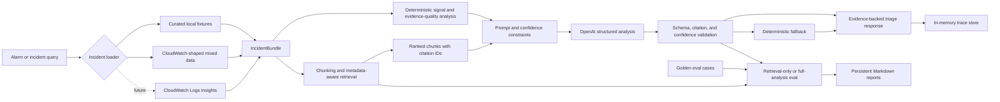

# AI Incident Triage Copilot

AI Incident Triage Copilot is a FastAPI service that turns operational logs,
metrics, deployment events, and runbooks into an evidence-backed incident
assessment. It combines deterministic filtering and safety rules with retrieval
and optional OpenAI analysis. The system returns a leading hypothesis for human
investigation, not an autonomous root-cause verdict.

The repository uses synthetic CloudWatch-shaped data. It contains no proprietary
or real production logs.

## Why This Project

A basic LLM demo can generate a plausible incident summary. A production-minded
AI system also needs to explain where its evidence came from, handle missing or
conflicting signals, fail safely, and make regressions measurable.

This project demonstrates:

- Deterministic filtering by service, region, and time window
- A stable `IncidentBundle` contract across curated and mixed data sources
- Evidence-quality assessment separated from root-cause confidence
- Citation-ready chunking and operational evidence ranking
- Structured OpenAI output with backend schema and policy validation
- Confidence caps and deterministic fallback behavior
- Trace records for prompt, retrieval, latency, token, cost, and failure debugging
- Golden-set evaluation for retrieval, citations, answer concepts, and fallback
- Offline unit and FastAPI integration tests

## Architecture



## Request Flow

```text
service + region + time window
  -> deterministic filtering
  -> IncidentBundle
  -> evidence-quality assessment
  -> evidence chunks and retrieval
  -> OpenAI analysis
  -> backend validation
  -> citation-backed response or deterministic fallback
  -> trace and evaluation
```

Exact data boundaries remain deterministic. The LLM interprets already-scoped
evidence and proposes a candidate hypothesis. An on-call engineer verifies that
hypothesis using traces, dependency metrics, blast-radius analysis, and
mitigation results.

## Local Setup

Requirements: Python 3.10 or newer.

```bash
python3 -m venv .venv
source .venv/bin/activate
pip install -r backend/requirements-dev.txt
cp .env.example .env
```

Add an OpenAI API key to `.env` to enable generated analysis:

```text
OPENAI_API_KEY=your-key
OPENAI_MODEL=gpt-4.1-mini
```

The key is optional for deterministic endpoints, retrieval-only evaluation, and
the offline test suite.

Start the API:

```bash
cd backend
../.venv/bin/uvicorn app.main:app --reload
```

Open:

- API documentation: `http://localhost:8000/docs`
- Health check: `http://localhost:8000/health`

## Example

Filter mixed operational data into a scoped incident bundle:

```bash
curl -X POST http://localhost:8000/incident-query \
  -H "Content-Type: application/json" \
  -d '{
    "service": "checkout-api",
    "region": "us-west-2",
    "start_time": "2026-06-15T09:30:00Z",
    "end_time": "2026-06-15T09:45:00Z"
  }'
```

Run triage analysis for a curated incident:

```bash
curl -X POST http://localhost:8000/triage/analyze \
  -H "Content-Type: application/json" \
  -d '{"incident_id": "checkout_latency_spike", "top_k": 10}'
```

The response includes a summary, candidate hypothesis, confidence, citations,
fallback explanation when applicable, retrieved chunk IDs, trace ID, analysis
source, and a structured LLM failure code.

## API Surface

| Endpoint | Purpose |
| --- | --- |
| `GET /health` | Service health check |
| `GET /incidents/{incident_id}` | Load a curated evidence bundle |
| `GET /incidents/{incident_id}/summary` | Return high-level incident signals |
| `GET /incidents/{incident_id}/baseline-triage` | Assess deterministic signals and evidence quality |
| `GET /incidents/{incident_id}/investigation-evidence` | Rank overview evidence for initial triage |
| `POST /incident-query` | Filter mixed data by service, region, and time |
| `POST /retrieve` | Run question-specific retrieval |
| `POST /triage/analyze` | Analyze a curated incident |
| `POST /incident-query/triage/analyze` | Filter and analyze mixed data |
| `GET /traces/{trace_id}` | Inspect an in-memory analysis trace |
| `POST /eval/run` | Run retrieval-only or full-analysis evaluation |

## Tests

The default suite is offline and does not call OpenAI:

```bash
./.venv/bin/python -m pytest -q
```

It contains unit tests for signal analysis, retrieval evaluation, LLM parsing,
failure classification, citation validation, confidence caps, and fallback. API
integration tests cover routing, request validation, mixed-data filtering,
offline eval, fallback, and trace retrieval.

## Evaluation

Generate the deterministic retrieval report:

```bash
cd backend
../.venv/bin/python -m app.eval_report
```

Generate a full-analysis report using the configured OpenAI API:

```bash
../.venv/bin/python -m app.eval_report --run-analysis
```

Current six-case reports:

- [Retrieval evaluation](reports/retrieval-eval-report.md)
- [Full-analysis evaluation](reports/full-analysis-eval-report.md)

The recorded full-analysis run achieved 100% retrieval accuracy, citation
correctness, and expected-answer concept matching. Four of six cases triggered
fallback as designed because they contained weak, missing, conflicting, or no
incident evidence. These metrics cover one model run per case and do not prove
correctness for unknown production incidents.

## Deployment

Build and run the container from the repository root:

```bash
docker build -t ai-incident-triage-copilot .
docker run --rm -p 8000:8000 \
  -e OPENAI_API_KEY="$OPENAI_API_KEY" \
  ai-incident-triage-copilot
```

See [infra/README.md](infra/README.md) for AWS App Runner and ECS Fargate
deployment guidance, secrets, health checks, observability, and current storage
limitations.

The container definition is included but was not built in the current
development environment because Docker was unavailable. The local FastAPI
startup and `/health` endpoint were verified directly.

## Important Design Decisions

- **Deterministic filtering before AI:** exact service, region, time, and access
  boundaries should be reproducible and testable.
- **Evidence quality is not root-cause confidence:** deterministic rules assess
  coverage, signal strength, consistency, specificity, alignment, and gaps. They
  do not try to enumerate every possible incident cause.
- **Retrieval and generation are evaluated separately:** a wrong answer can come
  from missing evidence or incorrect model reasoning, and the fixes differ.
- **Citations are allowlisted:** the model may cite only chunks included in its
  retrieved context.
- **Human control remains explicit:** the output narrows the investigation; it
  does not autonomously perform consequential remediation.

## Limitations

- Data is synthetic and local; the real CloudWatch loader is a post-MVP adapter.
- Retrieval uses deterministic operational ranking and keyword matching, not a
  vector database or semantic reranker.
- Traces are stored in memory and disappear when the process restarts.
- Eval reports use six known cases and one model run per case.
- The service does not yet include authentication, authorization, or tenant
  isolation.
- No frontend is included; FastAPI's generated API documentation is the UI.

## Project Structure

```text
backend/app/        FastAPI routes and incident-triage pipeline
backend/tests/      Offline unit and API integration tests
data/               Synthetic fixtures, mixed sources, and golden eval cases
docs/               Public project and setup documentation
infra/              Container and AWS deployment guidance
reports/            Persistent retrieval and full-analysis eval reports
```
